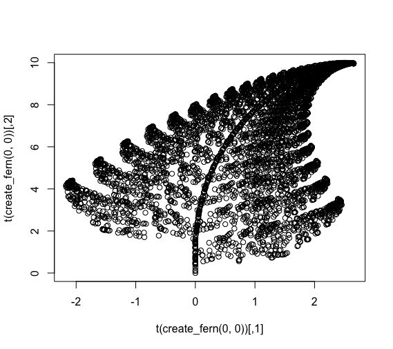

# Mini Projects

This is a collection of projects that are too small to warrant their own repo 🎨

📁 - folder containing all project files

📊 - any associated plots/images

📃 - script/notebook of project (if applicable) 

# Fractal Fern ([📁](fractals) / [📊](fractals/fractal_fern.png/) / [📃](fractals/fern_function.Rmd))

A function which plots a fern such as the one below!

